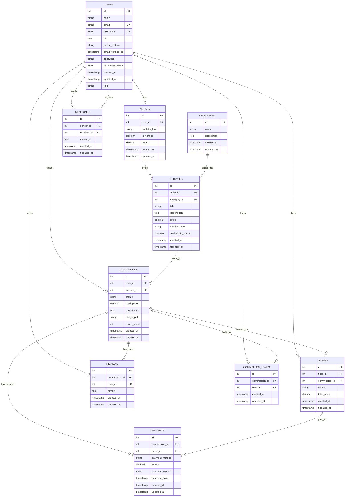

# Platform Komisi Karya Seni Bergambar

## Deskripsi Singkat Proyek

Platform Komisi Karya Seni Bergambar adalah aplikasi web yang dibangun menggunakan Laravel 11. Tujuan utama proyek ini adalah untuk menyediakan platform yang menghubungkan seniman dengan pengguna (klien) yang ingin memesan karya seni kustom (komisi). Pengguna dapat menjelajahi karya seniman, memesan komisi, dan berinteraksi dengan seniman, sementara seniman dapat memamerkan portofolio mereka, mengelola layanan yang ditawarkan, dan menangani pesanan komisi.

## Status Proyek Saat Ini

Proyek ini memiliki struktur dasar yang fungsional untuk beberapa fitur inti. Namun, terdapat beberapa bug kritis yang perlu segera ditangani, fitur yang belum sepenuhnya terimplementasi, dan beberapa area yang memerlukan pengembangan lebih lanjut untuk mencapai fungsionalitas penuh dan pengalaman pengguna yang optimal. Rencana pengembangan terstruktur telah diidentifikasi untuk mengatasi isu-isu ini dan menambahkan fitur-fitur baru.

Dokumen analisis dan perencanaan lebih detail dapat ditemukan di:
*   [`project_analysis_and_plan.md`](project_analysis_and_plan.md)
*   [`artist_order_management_plan.md`](artist_order_management_plan.md)
*   [`fix_order_creation_plan.md`](fix_order_creation_plan.md)

## Fitur Utama (Telah Diimplementasikan atau Sebagian Besar Fungsional)

Berikut adalah fitur-fitur utama yang saat ini sudah berjalan atau fungsionalitas backend-nya sebagian besar telah ada:

*   **Autentikasi Pengguna:** Registrasi, login, dan fungsionalitas reset password standar Laravel.
*   **Halaman Sambutan:** Menampilkan daftar komisi yang tersedia untuk umum.
*   **Fitur "Suka" (Love) pada Komisi:** Pengguna dapat menyukai/membatalkan suka pada komisi, dan jumlah suka akan diperbarui.
*   **Ulasan Komisi:** Pengguna dapat menambahkan ulasan untuk komisi yang telah selesai.
*   **Fungsionalitas Dasar Chat (Backend):**
    *   Melihat daftar percakapan pengguna.
    *   Menampilkan detail percakapan tertentu.
    *   Mengirim pesan (tersimpan di database dan memicu event).
*   **Daftar Seniman (Dasar):** Menampilkan pengguna yang memiliki komisi (dianggap sebagai seniman).
*   **Halaman Detail Seniman (Dasar):** Menampilkan informasi dasar seniman dan komisi yang mereka miliki.
*   **Manajemen Komisi oleh Pengguna:** Pengguna dapat membuat, melihat, mengedit, dan menghapus komisi milik mereka sendiri.

## Isu dan Bug yang Diketahui

Beberapa isu dan bug yang telah teridentifikasi dan memerlukan perhatian:

*   **Kritis: Kegagalan Pembuatan Pesanan (Order Creation Failure):** Disebabkan oleh properti `$fillable` yang hilang di model `Order` dan kolom `commission_id` yang hilang di tabel `orders`. Rencana perbaikan detail terdapat di [`fix_order_creation_plan.md`](fix_order_creation_plan.md).
*   **Rute Profil Pengguna Belum Terimplementasi:** Rute `/profile` belum memiliki metode `profile()` di `UserController`.
*   **Kesalahan Daftar Komisi di Halaman Indeks:** Halaman indeks komisi (`/commissions`) saat ini menampilkan komisi milik pengguna yang login saja, bukan semua komisi publik. Selain itu, ada kesalahan routing dimana `GET /commissions` mengarah ke `create` bukan `index`.
*   **Logika Keliru pada `OrderController@show`:** Metode ini keliru mengambil `Commission` berdasarkan ID, bukan `Order`.
*   **Ketidaksesuaian Skema Tabel `artists`:** Kolom `portfolio_link`, `is_verified`, `rating` didefinisikan di model `Artist` tetapi tidak ada di migrasi tabel `artists`.
*   **Ketidaksesuaian Skema Tabel `services`:** Kolom `category_id` untuk relasi ke kategori hilang dari tabel `services`.
*   **Typo Minor pada Migrasi `commission_loves`:** Perlu dikoreksi pada metode `down()`.
*   **Komentar yang Salah Tempat pada Migrasi `users`**.
*   **Visibilitas Status Komisi Internal:** Saat ini, status alur kerja internal komisi (seperti `ordered_pending_artist_action`) kemungkinan terlihat oleh publik secara luas, padahal idealnya hanya relevan untuk seniman, klien yang memesan, dan admin. Status publik di marketplace seharusnya lebih umum (misalnya, "Sudah Dipesan").

## Fitur yang Belum Selesai atau Sebagian Diimplementasikan

Fitur-fitur berikut telah dimulai namun belum sepenuhnya fungsional atau terintegrasi:

*   **Profil Seniman Tingkat Lanjut:** Model `Artist` dan tabel `artists` ada, namun belum sepenuhnya dimanfaatkan untuk profil seniman yang lebih detail (portofolio, verifikasi, rating). `ArtistController` saat ini hanya memperlakukan pengguna dengan komisi sebagai seniman.
*   **Manajemen Layanan oleh Seniman:** Model `Service` dan `Category` ada, namun fungsionalitas bagi seniman untuk mendefinisikan, mengkategorikan, dan menawarkan layanan spesifik belum terintegrasi penuh ke dalam alur komisi. Relasi `service()` di model `Commission` masih dikomentari.
*   **Pelacakan Pembayaran Detail:** Model `Payment` dan tabel `payments` ada, namun alur pemesanan saat ini hanya menyederhanakan status order menjadi 'paid' tanpa integrasi gateway pembayaran atau penggunaan model `Payment` secara detail.
*   **Chat Real-time (Frontend):** Backend telah siap dengan event broadcasting (`MessageSent`), namun implementasi sisi klien (Laravel Echo) untuk pengalaman chat real-time belum ada.
*   **Panel Admin:** Fungsionalitas admin yang komprehensif untuk mengelola pengguna, seniman, komisi, dll., belum dikembangkan secara menyeluruh.
*   **Persistensi Detail Pesanan:** `OrderController@confirmPayment` belum menyimpan `total_price` ke dalam tabel `orders`.
*   **Relasi Model yang Hilang:** Beberapa relasi penting (seperti `orders()`, `reviews()`, `messages()`) belum didefinisikan di model `User`.
*   **Inkonsistensi Penggunaan `name` vs. `username`:** Pada tabel `users`, perlu ada standarisasi penggunaan antara `name` dan `username`.

## Fitur yang Direncanakan & Pengembangan Selanjutnya

Berikut adalah garis besar fitur yang direncanakan untuk pengembangan di masa mendatang:

*   **Sistem Profil Seniman Penuh:**
    *   Memungkinkan pengguna mendaftar/ditetapkan sebagai seniman.
    *   Manajemen profil seniman yang diperluas (portofolio, bio, dll.).
    *   Proses verifikasi seniman.
*   **Manajemen Layanan Penuh oleh Seniman:**
    *   Seniman dapat mendefinisikan layanan spesifik yang ditawarkan.
    *   Pengkategorian layanan.
    *   Integrasi layanan ke dalam alur pemesanan komisi.
*   **Integrasi Gateway Pembayaran dan Pelacakan Pembayaran Detail:**
    *   Implementasi `PaymentController`.
    *   Integrasi dengan gateway pembayaran (misalnya, Midtrans, Stripe).
    *   Pembuatan record `Payment` setelah transaksi berhasil.
*   **Implementasi Penuh Chat Real-Time:**
    *   Konfigurasi Laravel Broadcasting (Pusher, Ably, atau self-hosted).
    *   Implementasi Laravel Echo di sisi klien.
*   **Pengembangan Panel Admin Komprehensif:**
    *   Area khusus untuk admin mengelola berbagai aspek platform.
*   **Alur Kerja Manajemen Pesanan untuk Seniman:**
    *   Antarmuka bagi seniman untuk melihat dan mengelola pesanan masuk.
    *   Pembaruan status komisi oleh seniman (misalnya, 'In Progress', 'Submitted for Review').
    *   Rencana detail untuk fitur ini terdapat di [`artist_order_management_plan.md`](artist_order_management_plan.md).
    *   Akan ada pembedaan yang jelas antara status komisi yang ditampilkan secara publik di marketplace (misalnya, "Tersedia", "Sudah Dipesan") dan status alur kerja internal yang lebih detail (misalnya, `ordered_pending_artist_action`, `In Progress`) yang hanya dapat diakses oleh pihak-pihak terkait (seniman, klien, admin).
*   **Perbaikan Bug dan Isu yang Ada:** Menyelesaikan semua bug yang teridentifikasi.
*   **Penyempurnaan UI/UX:** Meningkatkan pengalaman pengguna secara keseluruhan.

## Gambaran Model Data (ERD)



## Sorotan Rencana Pengembangan

Pengembangan proyek ini akan mengikuti pendekatan bertahap seperti yang diuraikan dalam [`project_analysis_and_plan.md`](project_analysis_and_plan.md):
*   **Fase 1:** Perbaikan Segera (Bug Kritis & Isu Mendesak)
*   **Fase 2:** Penyelesaian Fungsionalitas Inti & Penanganan Isu Desain
*   **Fase 3:** Pengembangan Fitur yang Belum Selesai/Direncanakan
*   **Fase 4:** Penyempurnaan dan Pengujian

## Instalasi dan Pengaturan

1.  **Clone repository:**
    ```bash
    git clone <URL_REPOSITORY_ANDA>
    cd <NAMA_DIREKTORI_PROYEK>
    ```
2.  **Install dependensi Composer:**
    ```bash
    composer install
    ```
3.  **Salin file environment:**
    ```bash
    cp .env.example .env
    ```
4.  **Konfigurasi file `.env`:**
    *   Atur `DB_DATABASE`, `DB_USERNAME`, `DB_PASSWORD`, dll., sesuai dengan pengaturan database lokal Anda.
    *   Atur `APP_KEY` (atau generate di langkah berikutnya).
    *   Konfigurasi pengaturan lain yang relevan seperti mail, queue, dll.
5.  **Generate application key:**
    ```bash
    php artisan key:generate
    ```
6.  **Jalankan migrasi database dan seeder (jika ada):**
    ```bash
    php artisan migrate
    ```
    Jika Anda ingin mengisi data awal, jalankan seeder (pastikan seeder relevan telah dibuat dan didaftarkan di `DatabaseSeeder.php`):
    ```bash
    php artisan db:seed
    ```
    Seeder yang mungkin relevan berdasarkan struktur proyek: `UserSeeder`, `ArtistSeeder`, `CategorySeeder`, `ServiceSeeder`, `CommissionSeeder`.
7.  **Install dependensi NPM dan compile aset (jika menggunakan Vite/Mix):**
    ```bash
    npm install
    npm run dev
    ```
8.  **Jalankan development server:**
    ```bash
    php artisan serve
    ```
    Aplikasi akan tersedia di `http://localhost:8000` (atau port lain jika ditentukan).

**Catatan Tambahan:**
*   Untuk fungsionalitas chat real-time, Anda perlu mengkonfigurasi driver broadcasting (misalnya Pusher, Ably, atau Redis dengan Socket.IO) di file `.env` dan menjalankan queue worker jika diperlukan.
*   Pastikan environment lokal Anda (PHP, Composer, Node.js, Database Server) memenuhi persyaratan Laravel 11.

## Cara Berkontribusi

Terima kasih atas minat Anda untuk berkontribusi pada proyek ini! Saat ini, panduan kontribusi formal belum ditetapkan. Namun, Anda dapat memulai dengan:
1.  Melakukan fork pada repository.
2.  Membuat branch baru untuk fitur atau perbaikan bug Anda.
3.  Melakukan commit pada perubahan Anda.
4.  Membuat Pull Request ke branch utama.

Pastikan untuk mengikuti standar coding yang ada dan memberikan deskripsi yang jelas mengenai perubahan yang Anda ajukan.

---
*Dokumen ini dihasilkan berdasarkan analisis dari file-file perencanaan proyek.*
