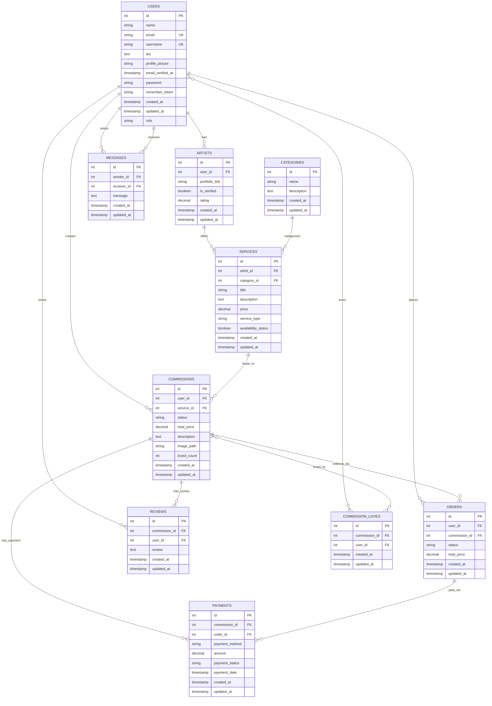

# Project Analysis and Development Plan

## 1. Introduction

This document provides a comprehensive analysis of the current state of the Laravel project. It outlines completed features, identifies broken or buggy functionalities, details incomplete or partially implemented features, and discusses data design issues. Based on this analysis, a development plan is proposed to address issues, complete features, and guide the project towards full functionality.

## 2. Overall Project Status

The project has a foundational structure for a platform connecting artists and users for commissions. Core functionalities like user authentication, commission creation, reviews, and basic chat are partially implemented. However, several critical bugs, data inconsistencies, and incomplete features hinder its current usability and robustness. Key areas like detailed artist profiles, service management by artists, and a proper order/payment flow require significant development.

### 2.1 Use Case Diagram

```mermaid
graph TB
    %% Actors
    Guest[👤 Guest<br/>Unauthenticated]
    User[👤 Registered User]
    Artist[🎨 Artist<br/>User with Commissions]
    Admin[⚙️ Administrator]

    %% User & Profile Management
    subgraph UserMgmt["👥 User & Profile Management"]
        UC_Register[Register Account]
        UC_Login[Login]
        UC_Logout[Logout]
        UC_ViewProfile[View Own Profile]
        UC_EditProfile[Edit Own Profile]
        UC_Admin_ManageUsers[Manage All Users]
    end

    %% Commission Lifecycle
    subgraph CommissionLC["📋 Commission Lifecycle"]
        UC_BrowseCommissions[Browse All Commissions]
        UC_ViewCommissionDetails[View Commission Details]
        UC_CreateCommission[Create New Commission]
        UC_EditOwnCommission[Edit Own Commission]
        UC_DeleteOwnCommission[Delete Own Commission]
        UC_LoveCommission[Love/Unlove Commission]
        UC_ReviewCommission[Add Review to Commission]
        UC_Admin_ManageCommissions[Manage All Commissions]
    end

    %% Artist Discovery
    subgraph ArtistDisc["🔍 Artist Discovery"]
        UC_ViewArtistListings[View Artist Listings]
        UC_ViewArtistProfile[View Artist Profile/Portfolio]
    end

    %% Ordering & Payment
    subgraph OrderPay["💳 Ordering & Payment"]
        UC_OrderCommission[Initiate Order for Commission]
        UC_ConfirmPayment[Confirm Payment]
        UC_ViewOwnOrders[View Own Order History]
    end

    %% Communication
    subgraph Comm["💬 Communication"]
        UC_ViewChatList[View Chat Conversations]
        UC_OpenChat[Open Chat with User/Artist]
        UC_SendMessage[Send/Receive Messages]
    end

    %% Planned Features - Services
    subgraph PlannedSvc["🔧 Planned: Service System"]
        UC_Artist_ManageServices[Manage Own Services]
        UC_Admin_ManageCategories[Manage Service Categories]
        UC_BrowseServices[Browse Services by Category]
        UC_CommissionService[Commission a Service]
    end

    %% Planned Features - Artist
    subgraph PlannedArt["🎯 Planned: Artist Features"]
        UC_Artist_ManagePortfolio[Manage Artist Portfolio]
        UC_Artist_Verification[Artist Verification Process]
    end

    %% Planned Features - Payment
    subgraph PlannedPay["💰 Planned: Full Payment System"]
        UC_ProcessRealPayment[Process Real Payment]
        UC_ManagePayments[Manage Payment Records]
    end

    %% Guest Relationships
    Guest --> UC_BrowseCommissions
    Guest --> UC_ViewCommissionDetails
    Guest --> UC_ViewArtistListings
    Guest --> UC_ViewArtistProfile
    Guest --> UC_Register
    Guest --> UC_Login
    Guest --> UC_BrowseServices

    %% User Relationships (inherits from Guest capabilities)
    User --> UC_Logout
    User --> UC_ViewProfile
    User --> UC_EditProfile
    User --> UC_CreateCommission
    User --> UC_EditOwnCommission
    User --> UC_DeleteOwnCommission
    User --> UC_LoveCommission
    User --> UC_ReviewCommission
    User --> UC_OrderCommission
    User --> UC_ConfirmPayment
    User --> UC_ViewOwnOrders
    User --> UC_ViewChatList
    User --> UC_OpenChat
    User --> UC_SendMessage
    User --> UC_CommissionService

    %% Artist Relationships (specialized User)
    Artist --> UC_Artist_ManageServices
    Artist --> UC_Artist_ManagePortfolio
    Artist --> UC_Artist_Verification

    %% Admin Relationships (specialized User)
    Admin --> UC_Admin_ManageUsers
    Admin --> UC_Admin_ManageCommissions
    Admin --> UC_Admin_ManageCategories
    Admin --> UC_ManagePayments
    Admin --> UC_ProcessRealPayment

    %% Include Dependencies (shown with dashed lines)
    UC_CreateCommission -.->|requires| UC_Login
    UC_EditOwnCommission -.->|requires| UC_Login
    UC_ReviewCommission -.->|requires| UC_Login
    UC_OrderCommission -.->|requires| UC_Login
    UC_OrderCommission -.->|includes| UC_ConfirmPayment
    UC_Artist_ManageServices -.->|requires| UC_Login

    %% Actor Inheritance (shown with thick lines)
    User ==> Guest
    Artist ==> User
    Admin ==> User

    %% Styling
    classDef actorStyle fill:#e1f5fe,stroke:#01579b,stroke-width:2px,color:#000
    classDef plannedStyle fill:#fff3e0,stroke:#e65100,stroke-width:2px,stroke-dasharray: 5 5
    classDef adminStyle fill:#f3e5f5,stroke:#4a148c,stroke-width:2px

    class Guest,User,Artist,Admin actorStyle
    class UC_Artist_ManageServices,UC_Admin_ManageCategories,UC_BrowseServices,UC_CommissionService,UC_Artist_ManagePortfolio,UC_Artist_Verification,UC_ProcessRealPayment,UC_ManagePayments plannedStyle
    class UC_Admin_ManageUsers,UC_Admin_ManageCommissions,UC_Admin_ManageCategories,UC_ManagePayments adminStyle
```



## 3. Feature Breakdown

### 3.1. Completed Features (or mostly functional backend logic)

*   **User Authentication:** Standard Laravel authentication (login, registration, password reset via `Auth::routes()`) appears to be in place ([`routes/web.php:42`](routes/web.php:42)).
*   **Welcome Page:** Displays all commissions ([`app/Http/Controllers/CardController.php:10`](app/Http/Controllers/CardController.php:10), [`routes/web.php:25`](routes/web.php:25)).
*   **Commission "Love" Feature:** Users can "love" and "unlove" commissions, with counts updated ([`app/Http/Controllers/CommissionController.php:116`](app/Http/Controllers/CommissionController.php:116), [`app/Models/Commission.php:26`](app/Models/Commission.php:26), [`database/migrations/2024_10_22_080834_create_commission_loves_table.php`](database/migrations/2024_10_22_080834_create_commission_loves_table.php:1)).
*   **Commission Reviews:** Users can add reviews to commissions ([`app/Http/Controllers/CommissionController.php:149`](app/Http/Controllers/CommissionController.php:149), [`app/Models/Review.php`](app/Models/Review.php:1), [`database/migrations/2024_10_22_093815_create_reviews_table.php`](database/migrations/2024_10_22_093815_create_reviews_table.php:1)).
*   **Basic Chat Functionality (Backend):**
    *   Listing user's conversations ([`app/Http/Controllers/ChatController.php:13`](app/Http/Controllers/ChatController.php:13)).
    *   Showing a specific chat thread ([`app/Http/Controllers/ChatController.php:32`](app/Http/Controllers/ChatController.php:32)).
    *   Sending messages (creates DB record, broadcasts event) ([`app/Http/Controllers/ChatController.php:45`](app/Http/Controllers/ChatController.php:45)).
    *   `Message` model and table are well-defined ([`app/Models/Message.php`](app/Models/Message.php:1), [`database/migrations/2024_10_04_104159_create_messages_table.php`](database/migrations/2024_10_04_104159_create_messages_table.php:1)).
*   **Artist Listing (Basic):** Displays users who have commissions ([`app/Http/Controllers/ArtistController.php:11`](app/Http/Controllers/ArtistController.php:11)).
*   **Artist Detail Page (Basic):** Shows a specific user (artist) and their commissions ([`app/Http/Controllers/ArtistController.php:21`](app/Http/Controllers/ArtistController.php:21)).
*   **User Commission Management (CRUD by Owner):**
    *   Users can create, view, edit, and delete their own commissions ([`app/Http/Controllers/CommissionController.php`](app/Http/Controllers/CommissionController.php:1)).
    *   `Commission` model and table are mostly well-defined for this scope ([`app/Models/Commission.php`](app/Models/Commission.php:1), [`database/migrations/2024_09_29_013755_create_commissions_table.php`](database/migrations/2024_09_29_013755_create_commissions_table.php:1)).

### 3.2. Broken Features & Bugs

*   **Critical: Order Creation Failure due to Missing `$fillable`:**
    *   **Issue:** [`app/Models/Order.php`](app/Models/Order.php:1) lacks a `$fillable` array. `Order::create()` in [`app/Http/Controllers/OrderController.php:46`](app/Http/Controllers/OrderController.php:46) will throw a `MassAssignmentException`.
    *   **Affected:** Core order creation functionality.
*   **Critical: Orders Not Linked to Commissions in DB:**
    *   **Issue:** The `orders` table migration ([`database/migrations/2024_09_29_145424_create_orders_table.php`](database/migrations/2024_09_29_145424_create_orders_table.php:1)) is missing the `commission_id` foreign key column.
    *   **Affected:** `OrderController@confirmPayment` cannot save `commission_id`. The `Order->commission()` relationship in [`app/Models/Order.php:10`](app/Models/Order.php:10) will not work.
*   **Missing User Profile Route Implementation:**
    *   **Issue:** Route `GET /profile` ([`routes/web.php:39`](routes/web.php:39)) points to `UserController@profile`, but this method is missing in [`app/Http/Controllers/UserController.php`](app/Http/Controllers/UserController.php:1).
    *   **Affected:** User profile access via the dedicated `/profile` route.
*   **Incorrect Commission Listing in `CommissionController@index`:**
    *   **Issue:** The method fetches all commissions then immediately overwrites the variable with only the logged-in user's commissions ([`app/Http/Controllers/CommissionController.php:16-18`](app/Http/Controllers/CommissionController.php:16-18)). A general index page should show all (or paginated all) commissions.
    *   **Affected:** Display of all commissions.
*   **Route Mismatch for Commission Index/Create:**
    *   **Issue:** `GET /commissions` route ([`routes/web.php:48`](routes/web.php:48)) points to `CommissionController@create` instead of `CommissionController@index`.
    *   **Affected:** Standard RESTful routing for commissions.
*   **Incorrect `OrderController@show` Logic:**
    *   **Issue:** The `show($id)` method in [`app/Http/Controllers/OrderController.php:20`](app/Http/Controllers/OrderController.php:20) uses `$id` to find a `Commission`, not an `Order`. The route `GET /orders/{order}` ([`routes/web.php:66`](routes/web.php:66)) implies it should show an `Order`.
    *   **Affected:** Displaying specific order details.
*   **`artists` Table Schema Mismatch with Model:**
    *   **Issue:** [`app/Models/Artist.php`](app/Models/Artist.php:10) defines `portfolio_link`, `is_verified`, `rating` in `$fillable`, but these columns are missing in the `artists` table migration ([`database/migrations/2024_09_29_013731_create_artists_table.php`](database/migrations/2024_09_29_013731_create_artists_table.php:1)).
    *   **Affected:** Any attempt to save these attributes for an `Artist` model.
*   **`services` Table Missing `category_id`:**
    *   **Issue:** [`app/Models/Service.php`](app/Models/Service.php:17) defines a `category()` relationship, implying a `category_id` foreign key, but this column is missing in the `services` table migration ([`database/migrations/2024_09_29_013733_create_services_table.php`](database/migrations/2024_09_29_013733_create_services_table.php:1)).
    *   **Affected:** Categorization of services.
*   **Minor Typo in `commission_loves` Migration:**
    *   **Issue:** The `down()` method uses `Schema::dropIfExists('commission_love')` (singular) instead of `commission_loves` (plural) ([`database/migrations/2024_10_22_080834_create_commission_loves_table.php:31`](database/migrations/2024_10_22_080834_create_commission_loves_table.php:31)).
    *   **Affected:** Clean rollback of this migration.
*   **Misplaced Comment in `users` Table Migration:**
    *   **Issue:** Comment `// Menambahkan kolom 'username'` is on the `bio` column definition line ([`database/migrations/2014_10_12_000000_create_users_table.php:21`](database/migrations/2014_10_12_000000_create_users_table.php:21)).
    *   **Affected:** Readability/clarity of the migration file.

### 3.3. Incomplete or Partially Implemented Features

*   **Advanced Artist Profiles:**
    *   The `Artist` model ([`app/Models/Artist.php`](app/Models/Artist.php:1)) and `artists` table exist, intended for artist-specific details (portfolio, verification, rating).
    *   However, `ArtistController` ([`app/Http/Controllers/ArtistController.php`](app/Http/Controllers/ArtistController.php:1)) treats any `User` with commissions as an artist and doesn't use the `Artist` model for extended profiles. The `artists` table schema is also incomplete (see Bugs).
*   **Service Management by Artists:**
    *   Models `Service` ([`app/Models/Service.php`](app/Models/Service.php:1)) and `Category` ([`app/Models/Category.php`](app/Models/Category.php:1)) exist, along with their tables (though `services` table is missing `category_id`).
    *   `ServiceController` ([`app/Http/Controllers/ServiceController.php`](app/Http/Controllers/ServiceController.php)) is registered as a resource ([`routes/web.php:32`](routes/web.php:32)).
    *   The intention seems to be for artists to define specific services, which can be categorized and then commissioned. This is not integrated into the commission workflow (e.g., `Commission` model has a commented-out `service()` relationship ([`app/Models/Commission.php:42`](app/Models/Commission.php:42))).
*   **Detailed Payment Tracking:**
    *   `Payment` model ([`app/Models/Payment.php`](app/Models/Payment.php:1)) and `payments` table ([`database/migrations/2024_09_29_013809_create_payments_table.php`](database/migrations/2024_09_29_013809_create_payments_table.php:1)) are well-defined for detailed payment records.
    *   `PaymentController` ([`app/Http/Controllers/PaymentController.php`](app/Http/Controllers/PaymentController.php)) is registered as a resource ([`routes/web.php:33`](routes/web.php:33)).
    *   This is bypassed by the current simplified order creation in `OrderController@confirmPayment`, which just sets an order status to 'paid'. No actual payment gateway integration or use of the `Payment` model is evident in the core flow.
*   **Real-time Chat:**
    *   Backend broadcasts `MessageSent` event ([`app/Http/Controllers/ChatController.php:61`](app/Http/Controllers/ChatController.php:61)).
    *   Full functionality requires setup and verification of Laravel Echo (client-side JS) and a broadcasting driver (Pusher, Redis, etc.).
*   **Admin Panel/Functionality:**
    *   `UserController@index` is admin-only ([`app/Http/Controllers/UserController.php:20`](app/Http/Controllers/UserController.php:20)).
    *   A comprehensive admin panel for managing users, artists, commissions, etc., is not apparent and likely an incomplete area.
*   **Order Details Persistence:**
    *   `OrderController@confirmPayment` does not populate `total_price` in the `orders` table. Orders should capture critical details like price at the time of purchase.
*   **Missing Relationships in `User` Model:**
    *   [`app/Models/User.php`](app/Models/User.php:1) is missing `orders()`, `reviews()`, `messages()`, and `loves()` relationships, which would simplify data retrieval.

### 3.4. Data Design Issues

*   **`name` vs. `username` in `users` Table:**
    *   The `users` table ([`database/migrations/2014_10_12_000000_create_users_table.php`](database/migrations/2014_10_12_000000_create_users_table.php:1)) and `User` model ([`app/Models/User.php:18`](app/Models/User.php:18)) contain both `name` and `username` fields.
    *   `UserController@store` (user creation) uses `name` ([`app/Http/Controllers/UserController.php:52`](app/Http/Controllers/UserController.php:52)).
    *   `UserController@update` (profile update) uses `username` ([`app/Http/Controllers/UserController.php:84`](app/Http/Controllers/UserController.php:84)).
    *   This inconsistency can lead to confusion about which field is primary, data redundancy, and potential issues in displaying user information. A clear strategy is needed (e.g., use one, or ensure both are managed consistently).

### 3.5 Database Schema (ERD)



## 4. Recommendations & Development Plan

### 4.1. Phase 1: Immediate Fixes (Bugs & Critical Issues)

1.  **Fix Order Creation:**
    *   **Task:** Add `$fillable` array to [`app/Models/Order.php`](app/Models/Order.php:1).
        ```php
        protected $fillable = ['user_id', 'commission_id', 'status', 'total_price'];
        ```
    *   **Task:** Create a new migration to add `commission_id` (and ensure it's nullable if orders can exist without commissions, or not nullable if always required) and potentially other necessary fields (like `total_price` if it's to be stored at order time) to the `orders` table.
        ```bash
        php artisan make:migration add_commission_id_to_orders_table --table=orders
        ```
        In the new migration's `up()` method:
        ```php
        Schema::table('orders', function (Blueprint $table) {
            $table->foreignId('commission_id')->nullable()->constrained()->onDelete('set null'); // Or onDelete('cascade') if appropriate
            // Ensure total_price column exists as per migration 2024_09_29_145424_create_orders_table.php
            // If total_price is intended to be snapshot from commission, ensure it's populated in OrderController.
        });
        ```
        In the `down()` method:
        ```php
        Schema::table('orders', function (Blueprint $table) {
            $table->dropForeign(['commission_id']);
            $table->dropColumn('commission_id');
        });
        ```
    *   **Task:** Update `OrderController@confirmPayment` ([`app/Http/Controllers/OrderController.php:46`](app/Http/Controllers/OrderController.php:46)) to correctly pass `commission_id` and also fetch and pass `total_price` from the `Commission` model to be stored with the `Order`.
2.  **Fix User Profile Route:**
    *   **Task:** Implement the `profile()` method in [`app/Http/Controllers/UserController.php`](app/Http/Controllers/UserController.php:1) to show the authenticated user's profile (similar to `show(Auth::id())` but perhaps with a dedicated view or logic).
3.  **Correct `artists` Table Schema:**
    *   **Task:** Create a new migration to add `portfolio_link` (string, nullable), `is_verified` (boolean, default false), and `rating` (decimal/float, nullable) columns to the `artists` table to match [`app/Models/Artist.php`](app/Models/Artist.php:10).
4.  **Correct `services` Table Schema:**
    *   **Task:** Create a new migration to add `category_id` (foreignId, nullable) to the `services` table and set up the foreign key constraint to `categories.id`.
5.  **Fix Commission Listing (`CommissionController@index`):**
    *   **Task:** Modify [`app/Http/Controllers/CommissionController.php:16-18`](app/Http/Controllers/CommissionController.php:16-18). If it's for a public index, remove line 18. If it's for "my commissions", rename the method and route appropriately (e.g., `myCommissions`). Create a separate `index` method for public listing.
6.  **Fix Commission Routes:**
    *   **Task:** In [`routes/web.php`](routes/web.php:1), change `Route::get('/commissions', [CommissionController::class, 'create'])->name('commissions.index');` ([`routes/web.php:48`](routes/web.php:48)) to point to `index` method for listing, and add a new route `Route::get('/commissions/create', [CommissionController::class, 'create'])->name('commissions.create');` for the creation form.
7.  **Fix `OrderController@show`:**
    *   **Task:** If `GET /orders/{order}` is meant to show an `Order`'s details, refactor [`app/Http/Controllers/OrderController.php:20`](app/Http/Controllers/OrderController.php:20) to fetch an `Order` by `$id` and pass that to the view. The view `orders.show` might need adjustment. The route `GET /commissions/{commission}/order` ([`routes/web.php:69`](routes/web.php:69)) can remain if a commission-centric order page is desired.
8.  **Fix Migration Typos/Comments:**
    *   **Task:** Correct `Schema::dropIfExists('commission_love')` to `commission_loves` in [`database/migrations/2024_10_22_080834_create_commission_loves_table.php:31`](database/migrations/2024_10_22_080834_create_commission_loves_table.php:31).
    *   **Task:** Correct misplaced comment in [`database/migrations/2014_10_12_000000_create_users_table.php:21`](database/migrations/2014_10_12_000000_create_users_table.php:21).

### 4.2. Phase 2: Completing Core Functionality & Addressing Design Issues

1.  **Standardize `name` vs. `username`:**
    *   **Task:** Decide on a primary field (e.g., `username` for login/display, `name` for full name).
    *   Update `UserController@store` to handle the chosen primary field and potentially populate the other.
    *   Update `User` model, forms, and views for consistency.
    *   Consider a migration if data needs to be consolidated.
2.  **Add Missing Model Relationships:**
    *   **Task:** In [`app/Models/User.php`](app/Models/User.php:1), add `orders()`, `reviews()`, `messagesSent()`, `messagesReceived()`, and `lovedCommissions()` (or similar for `commission_loves` pivot) relationships.
    *   **Task:** In [`app/Models/Order.php`](app/Models/Order.php:1), add the `user()` relationship (`belongsTo(User::class)`).
3.  **Refine Order Process:**
    *   Ensure `OrderController@confirmPayment` correctly populates `total_price` in the `orders` table by fetching it from the related `Commission`.
    *   Develop the `orders.show` view to display actual order details from an `Order` model.

### 4.3. Phase 3: Developing Incomplete/Planned Features

1.  **Full Artist Profile System:**
    *   **Goal:** Allow users to register as artists (or be designated), manage extended artist profiles (portfolio, bio from `users` table, etc.), and have these profiles displayed.
    *   **Tasks:**
        *   Refine `Artist` model ([`app/Models/Artist.php`](app/Models/Artist.php:1)) and ensure its table schema is correct (Phase 1 fix).
        *   Develop `ArtistController` methods for managing these profiles (e.g., `create`, `store`, `edit`, `update` for artist-specific info). This might involve a separate registration step or an "upgrade to artist" feature.
        *   Update `ArtistController@index` and `ArtistController@search` (rename to `show`) to utilize the `Artist` model and display richer artist profiles.
        *   Create views for displaying and managing these profiles.
2.  **Service Management by Artists:**
    *   **Goal:** Enable artists to define specific services they offer, categorize them, and allow users to commission these services.
    *   **Tasks:**
        *   Ensure `services` table has `category_id` (Phase 1 fix).
        *   Implement `ServiceController` CRUD for artists to manage their services.
        *   Implement `Category` management (perhaps admin-only or predefined).
        *   Uncomment and implement the `service()` relationship in [`app/Models/Commission.php`](app/Models/Commission.php:42) and add `service_id` to the `commissions` table via a new migration.
        *   Modify the commission creation process (`CommissionController@create/store`) to optionally link to a `Service`.
        *   Update views to display services on artist profiles and allow commissioning from a service.
3.  **Detailed Payment Tracking & Gateway Integration:**
    *   **Goal:** Implement a robust payment system using the `Payment` model and integrate a payment gateway.
    *   **Tasks:**
        *   Implement `PaymentController` logic.
        *   Integrate a payment gateway (e.g., Stripe, PayPal).
        *   Modify `OrderController@confirmPayment` (or a new payment flow) to create `Payment` records upon successful gateway transaction.
        *   Update `Order` status based on `Payment` status.
        *   Uncomment and implement the `payments()` relationship in [`app/Models/Commission.php`](app/Models/Commission.php:47).
4.  **Full Real-Time Chat Implementation:**
    *   **Task:** Configure Laravel Broadcasting (choose driver: Pusher, Ably, or self-hosted with Redis/Socket.IO).
    *   **Task:** Implement client-side JavaScript using Laravel Echo to listen for `MessageSent` events and update the chat UI in real-time.
5.  **Admin Panel Development:**
    *   **Goal:** Create a dedicated area for administrators to manage users, artists, commissions, site settings, etc.
    *   **Tasks:**
        *   Define admin roles/permissions.
        *   Create admin-specific controllers and routes, protected by middleware.
        *   Develop views for admin dashboards and management interfaces.

### 4.4. Phase 4: Refinements and Testing

1.  **Code Review and Refactoring:**
    *   Improve code consistency (naming conventions, route structures).
    *   Optimize queries.
    *   Ensure adherence to SOLID principles and other best practices.
2.  **Comprehensive Testing:**
    *   Write unit tests for models and critical business logic.
    *   Write feature tests for user flows and API endpoints.
    *   Perform manual UAT (User Acceptance Testing).
3.  **User Interface/User Experience (UI/UX) Review:**
    *   Evaluate and improve the overall usability and design of the application.

## 5. Conclusion

This project has a promising foundation but requires systematic effort to fix existing bugs, complete partially implemented features, and fully realize its planned functionalities. By following a phased approach, prioritizing critical fixes, and then iteratively developing larger features, the project can be brought to a stable, robust, and feature-complete state.
## Ringkasan Analisis Proyek (Bahasa Indonesia)

**Gambaran Umum Proyek:**
Proyek ini adalah platform berbasis Laravel yang bertujuan untuk menghubungkan seniman dengan pengguna untuk pemesanan karya seni (komisi). Pengguna dapat menjelajahi komisi, berinteraksi dengan seniman, dan melakukan pemesanan. Seniman dapat memamerkan karya mereka dan mengelola layanan yang ditawarkan.

**Fitur yang Sudah Diimplementasikan (Backend sebagian besar fungsional):**
*   Autentikasi Pengguna (registrasi, login, reset kata sandi)
*   Halaman selamat datang yang menampilkan komisi
*   Fitur "Suka/Favorit" pada komisi
*   Memberikan ulasan pada komisi
*   Fungsionalitas dasar backend untuk obrolan (daftar percakapan, mengirim/menerima pesan melalui database dan event)
*   Daftar dasar seniman (pengguna yang memiliki komisi)
*   Halaman detail dasar seniman yang menampilkan komisi mereka
*   Operasi CRUD bagi pengguna untuk mengelola komisi mereka sendiri

**Fitur yang Belum Diimplementasikan, Rusak, atau Tidak Lengkap:**
*   **Kritis:** Pembuatan pesanan rusak karena properti `$fillable` yang hilang di model `Order` dan `commission_id` yang hilang di tabel `orders`.
*   Rute halaman profil pengguna tidak diimplementasikan.
*   Daftar komisi hanya menampilkan komisi pengguna yang sedang login, bukan semua komisi.
*   Routing yang salah untuk pembuatan komisi.
*   Logika untuk menampilkan detail pesanan individu keliru.
*   Ketidakcocokan skema database untuk tabel `artists` (kolom `portfolio_link`, `is_verified`, `rating` hilang) dan `services` (kolom `category_id` hilang).
*   Profil seniman tingkat lanjut (menggunakan model dan tabel `Artist` khusus untuk portofolio, verifikasi, dll.) belum dikembangkan.
*   Manajemen layanan oleh seniman (mendefinisikan layanan spesifik yang dapat dikategorikan) tidak terintegrasi.
*   Pelacakan pembayaran terperinci dan integrasi gateway pembayaran aktual tidak ada.
*   Frontend obrolan real-time (pengaturan Echo sisi klien) tidak diimplementasikan.
*   Panel admin yang komprehensif sebagian besar tidak ada.
*   Detail pesanan seperti `total_price` tidak disimpan.
*   Beberapa relasi Eloquent penting hilang di model `User`.
*   Penggunaan kolom `name` vs. `username` yang tidak konsisten untuk pengguna.

**Fitur yang Direncanakan untuk Implementasi di Masa Depan:**
*   Sistem profil seniman yang berfungsi penuh dengan manajemen portofolio dan verifikasi.
*   Sistem manajemen layanan lengkap untuk seniman, yang memungkinkan pengguna memesan layanan tertentu.
*   Sistem pembayaran yang kuat dengan integrasi gateway pembayaran dan pelacakan terperinci.
*   Fungsionalitas obrolan real-time penuh (sisi klien).
*   Panel admin yang komprehensif untuk manajemen situs.