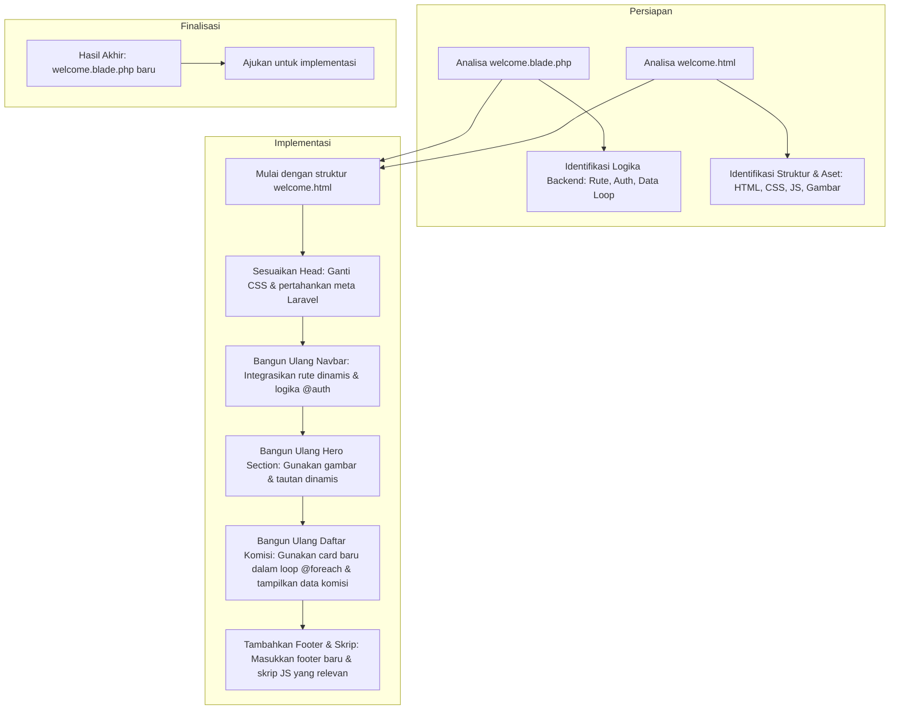

# Rencana Penggantian Tampilan Halaman Utama

Dokumen ini menguraikan rencana untuk mengganti styling dari file `resources/views/welcome.blade.php` dengan desain baru yang disediakan di `public/welcome-page/`.

## Tujuan

Mengadopsi struktur HTML dan aset (CSS, JS, Gambar) dari desain baru sambil mempertahankan semua fungsionalitas backend dinamis dari implementasi Laravel yang ada, termasuk:
-   Routing menggunakan helper `route()`.
-   Logika otentikasi pengguna (`@auth`, `@guest`).
-   Looping dan penampilan data dinamis (misalnya, daftar komisi).
-   Fungsionalitas "Love" untuk komisi.

## Diagram Rencana

## Detail Implementasi

1.  **Struktur Dasar & Aset:**
    *   Gunakan `public/welcome-page/welcome.html` sebagai templat HTML dasar.
    *   Hubungkan semua aset (CSS, JS, gambar) dari direktori `public/welcome-page/` menggunakan helper `asset()` Laravel untuk memastikan path yang benar.

2.  **Navbar (Bilah Navigasi):**
    *   Gunakan struktur HTML navbar dari desain baru.
    *   Buat semua tautan menjadi dinamis menggunakan `route('nama.rute')`.
    *   Implementasikan kembali logika `@auth` dan `@guest` untuk menampilkan tautan "Login/Register" atau "Profil/Logout" secara kondisional.

3.  **Hero Section:**
    *   Ganti bagian hero statis dengan yang dari desain baru.
    *   Pastikan semua tombol/tautan menggunakan helper `route()` untuk navigasi yang benar.

4.  **Daftar Komisi (Featured Commissions):**
    *   Ambil desain kartu (card) dari `welcome.html`.
    *   Gunakan kartu ini di dalam loop `@foreach($commissions as $commission)` yang ada.
    *   Petakan semua data dinamis (`$commission->description`, `$commission->user->name`, `number_format($commission->total_price)`, dll.) ke dalam struktur kartu yang baru.
    *   Integrasikan kembali fungsionalitas "love" ke dalam desain kartu baru, termasuk ikon dan atribut data yang diperlukan untuk JavaScript.

5.  **Footer & Skrip:**
    *   Tambahkan footer dari desain baru.
    *   Sertakan skrip JavaScript dari `welcome.html` untuk fungsionalitas *sticky header*.
    *   Pastikan skrip `love.js` dari implementasi lama disertakan untuk mendukung fungsionalitas "love".

Rencana ini telah disetujui untuk dilanjutkan ke tahap implementasi.